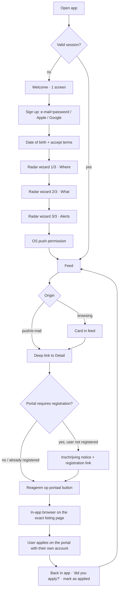

# PAPA RENT — UX flows

> Version 1.0 · 2026-09-06 · Complements `screens.md` (screen spec) and `notifications.md` (alert content).
> Convention: `[T]` = tap, `[S]` = system, `[E]` = error state. Final copy is always in NL and EN — see `screens.md`.
> **Status:** target flows. Push and e-mail delivery is implemented but has never been used with real users; the public demo uses fictional data.

---

## 0. Main path (map)

Product boundary: everything to the right of `Q` happens **on the portal**, with the user's own account. We never automate, never fill in forms, never store credentials.

---

## 1. First run

| # | Actor | Step | Rule |
|---|---|---|---|
| 1 | [S] | Splash ≤ 800 ms with wordmark | If bootstrap takes > 2 s, show the feed skeleton, not an endless spinner |
| 2 | [S] | Welcome, 1 screen: value proposition + 3 bullets + single CTA | Second, discreet link: "I already have an account" |
| 3 | [T] | Sign up: e-mail+password, Sign in with Apple, Continue with Google | Apple is mandatory on iOS if social login is offered (App Store §4.8) |
| 4 | [T] | Date of birth (date picker) + terms and privacy checkbox | DOB is mandatory: it drives age labels (jongeren/senior) and the legal minimum of 16 |
| 5 | [S] | Create account, persistent session (refresh token in keychain/keystore) | Never ask for the password again. Biometric lock is optional, enabled in Settings |
| 6 | [T] | **Radar 1/3 — Where**: search municipality/region, multi-select, or "Bij mij in de buurt" with radius (5/10/25/50 km) | Minimum 1 region. "Near me" asks for location permission *when tapped*, never before |
| 7 | [T] | **Radar 2/3 — What**: segment (Sociaal / Middenhuur / both), max rent (slider with marks at the current thresholds), minimum rooms, optional labels | Default: both segments, max rent = top of middenhuur, 1+ room |
| 8 | [T] | **Radar 3/3 — Alerts**: instant push (on), e-mail (instant or daily digest), quiet hours | Naming the radar is optional — automatic name: "Eindhoven · Sociaal · ≤ € 900" |
| 9 | [S] | OS push prompt, preceded by a pre-prompt explaining why | If denied: permanent banner in the feed with a shortcut to the OS settings |
| 10 | [S] | **Feed already populated** with the last 72 h of history matching the radar | Never show an empty feed in the first session; if there is no history, see §10 |

**Time budget**: steps 2–8 in ≤ 90 s. Every wizard step has "Overslaan / Skip" except step 1 (region).

---

## 2. Returning user

1. Open → valid session → (if biometric lock is on) Face ID/fingerprint → Feed.
2. The feed loads from the local cache in < 200 ms and revalidates in the background; an "N nieuw" badge at the top when new items arrive during the session.
3. If away for > 24 h: header "Terwijl je weg was: 12 nieuwe woningen" / "While you were away: 12 new homes".
4. Default order is always "newest first". We never re-sort by relevance unless the user asks.

---

## 3. Create / edit / delete a radar

**Create** (Settings → Radars → +, or the floating button in the feed):
1. The same 3-step wizard, now with a live count: "≈ 14 woningen per week" (estimate based on the last 28 days).
2. If the estimate is `0`, suggest widening: larger radius, +€100 rent, or include the second segment — with buttons that apply the suggestion.
3. If the estimate is `> 100/week`, warn about fatigue and suggest the daily digest instead of instant push.

**Edit**: opens in single-step mode (full form on one screen, not a wizard). Changes apply only to future alerts — we never resend history.

**Delete**: confirmation showing the number of alerts the radar produced. No trash bin; the action is declared irreversible.

**Duplicate**: a shortcut to copy a radar to another region (the default for a multi-region strategy).

**Unlimited radars** on every plan during the free phase.

---

## 4. Receive alert → detail → apply

| # | Step | Detail |
|---|---|---|
| 1 | Push arrives | Title and body per `notifications.md`. Deep link `paparent://listing/{id}?src=push` |
| 2 | App opens straight on the **Detail** | If the app was closed: cold start opens the detail, and "back" goes to the Feed, not to the OS |
| 3 | Detail loads | Facts, map, closing countdown, eligibility explanation, operator, allocation model (see `docs/knowledge/allocation-models.md`) |
| 4 | Registration check | If the portal requires *inschrijving*: an informational strip above the CTA (see §5) |
| 5 | [T] "Reageren op {portaal}" | Opens an **in-app browser** (SFSafariViewController / Custom Tabs) on the exact listing URL. Never a proprietary WebView, so the user can reuse their portal session |
| 6 | User applies on the portal | Out of our scope. We don't observe, we don't inject scripts |
| 7 | Return to the app | Bottom sheet: "Heb je gereageerd?" → Ja / Nog niet. If "Ja", the item is marked *Gereageerd* and leaves the main feed (it stays in "Mijn reacties") |
| 8 | Follow-up | If the listing closes in < 24 h and the user answered "Nog niet", a single reminder (see `notifications.md` §6) |

**Broken-link state** `[E]`: if the source URL returns 404/410, show "Deze woning is niet meer beschikbaar op {portaal}" with a "Terug naar feed" button, and mark the item as removed for all users (see `notifications.md` §9).

---

## 5. Registration nudge

Rule: **an application is only possible if the user is registered on the source portal**. The app says so before the tap, not after.

Per-listing states:

| State | Trigger | UI |
|---|---|---|
| Registration required, free | source metadata: `registration.required=true`, `fee=0` | Neutral strip: "Inschrijving vereist bij {portaal} · gratis" + "Nu inschrijven" link |
| Registration required, paid | `fee > 0` | Neutral strip: "Inschrijving vereist bij {portaal} · € {fee} per jaar" + link |
| No registration | `required=false` | No strip. Direct CTA |
| Unknown | metadata missing | Grey strip: "Controleer of inschrijving nodig is bij {portaal}" |

The user can manually tick "Ik ben al ingeschreven bij {portaal}" — just a local flag per portal, with no verification and no credentials. Once ticked, the strip disappears for that portal.

**Educational nudges** (max. 1 per session, dismissible forever; content comes from `market-rules.md`):
1. Free portals: "{aantal} regio's zijn gratis. Schrijf je vandaag in — je wachttijd begint nu."
2. Zoekpunten (regions with a points model): "Reageer minstens 4× per maand om zoekpunten op te bouwen." Show a counter for the current month based on the recorded "Ja, ik heb gereageerd" answers.
3. Never turn down an offer in a points region: shown when marking interest in a listing in a region with a points model.
4. Loting/DirectKans as a fast lane: shown to users with a short or unknown `inschrijfduur`.

---

## 6. Eligibility profile (optional, ≤ 60 s)

Entry: a dismissible banner in the feed after the 3rd alert, or Settings → Profiel.

1. Promise screen: "4 vragen. Geen documenten, nooit." + what the user gains: the "past bij jou" badge and hiding what they can't take.
2. Question 1 — Household size (1, 2, 3, 4, 5+).
3. Question 2 — Gross annual household income band (labelled bands, not typed numbers). Option "Liever niet zeggen".
4. Question 3 — "Woon je nu in een sociale huurwoning?" (doorstromer) Yes/No.
5. Question 4 — "Werk je in een sleutelberoep?" with a list of examples. Yes/No/Don't know.
6. Result: "We tonen nu wat bij je past" + toggle "Verberg wat niet bij mij past" (default: **off**; we filter only when the user asks).

Rules: age comes from the sign-up DOB. Nothing is mandatory. Everything is editable and erasable. Logic in detail: `eligibility.md`.

**"Wat je klaar moet hebben" checklist**: reachable from the listing detail, read-only, per allocation model. Explains *inkomensverklaring*, *werkgeversverklaring* etc. — **without ever asking for an upload**.

---

## 7. Subscription upsell (phase 2, planned — not now)

Trigger points, never an interstitial during onboarding:
1. When creating the **2nd radar** (free limit = 1).
2. When turning on instant push on a radar while the free plan gives a daily digest.
3. A permanent line in Settings → Abonnement.

Screen structure: two-column comparison (Gratis / Pro), monthly and yearly price, "Prijs per maand, opzegbaar wanneer je wilt", Apple/Google IAP CTA, "Herstel aankoop / Restore purchase" link, terms link. No fake countdown, no invented struck-through price.

Cancellation: a direct link to the OS subscription management. Never retain with a dark pattern.

---

## 8. Export / delete account

**Export** (Settings → Privacy → Exporteer mijn gegevens): generates a JSON with account, radars, banded profile, alert history and marked applications; delivered by e-mail within 24 h with an expiring link.

**Delete** (Settings → Privacy → Verwijder mijn account):
1. A screen explaining what is lost (radars, history, eligibility badge).
2. Confirmation by typing the word `VERWIJDER` / `DELETE`.
3. Immediate deletion of profile and radars; confirmation e-mail; a 7-day window in which the same account can be recovered via a link — after that, permanent purge.
4. If there is an active subscription: a warning that deleting the account does **not** cancel the store subscription, with a direct link.

---

## 9. Offline

| Situation | Behaviour |
|---|---|
| No network, app open | Thin bar at the top: "Geen internet · je ziet opgeslagen woningen". The feed serves the cache; cards lose the live countdown (they show "sluit {datum}") |
| No network, tap on "Reageren" | Blocked with a toast: "Je hebt internet nodig om te reageren" |
| Network returns | Silent revalidation + "N nieuw" badge |
| Push received offline | The OS delivers it when the network returns; if the listing has already closed, the detail shows the "gesloten" state and explains why |

---

## 10. Empty states

| Context | Rule |
|---|---|
| Empty feed in the 1st session | Never leave it blank: show the last 72 h for the region even outside the fine filter, labelled "Dichtbij je zoekopdracht" |
| Radar without results for 7 d | Card at the top of the feed: "Geen matches deze week" + 3 suggestion buttons (radius +10 km / +€100 / include middenhuur) |
| Empty Inbox | "Nog geen meldingen. We kijken mee — je hoort van ons." |
| Empty "Mijn reacties" | "Hier verschijnen woningen waarop je hebt gereageerd." |
| Profile not filled in | Never block the feed. Dismissible banner, at most once a week |

---

## 11. Errors

| Code | Situation | User message (NL / EN) | Action |
|---|---|---|---|
| `NET_OFFLINE` | No network | "Geen internet" / "No internet" | Automatic retry + manual button |
| `AUTH_EXPIRED` | Invalid refresh token | "Log opnieuw in om verder te gaan" / "Sign in again to continue" | Back to sign-in, radars preserved |
| `SOURCE_DOWN` | A specific source failing > 30 min | "{portaal} is tijdelijk onbereikbaar" / "{portal} is temporarily unavailable" | Banner only on affected radars; doesn't block the app |
| `LISTING_GONE` | Listing removed at the source | "Deze woning is niet meer beschikbaar" / "This home is no longer available" | Mark as removed, offer to go back |
| `PUSH_DENIED` | Permission denied | "Meldingen staan uit — je mist nieuwe woningen" / "Notifications are off — you're missing new homes" | Shortcut to OS settings |
| `IAP_FAILED` | Purchase failed | "De betaling is niet gelukt" / "The payment didn't go through" | Retry + Restore purchase |
| `SERVER_5XX` | Backend | "Er ging iets mis bij ons" / "Something went wrong on our side" | Retry with backoff; never show a stack trace |

Error principles: one sentence, no visible technical code, always a possible action, never blame the user.
